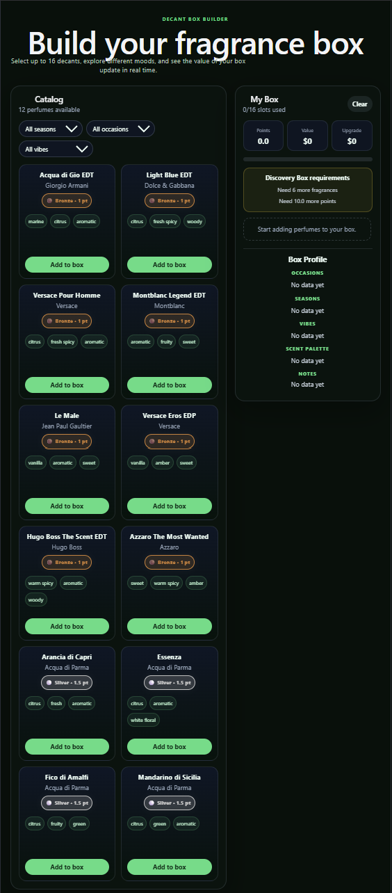

# Decant Builder

Interactive fragrance discovery platform that allows users to build a custom fragrance box using a point-based upgrade system.

## Overview

Decant Builder helps fragrance enthusiasts create personalized fragrance boxes by selecting decants from a curated catalog. The platform provides real-time feedback on scent coverage, note diversity, occasions, seasons, and overall value.

The goal is to combine fragrance discovery with an engaging product-building experience.

## Features

* Dynamic filtering by season, occasion, and vibe
* Tier-based fragrance catalog
* Real-time box builder
* Point-based upgrade system
* Value calculation engine
* Discovery Box validation rules
* Scent Palette analysis
* Unique note coverage tracking
* Notes Library modal
* Dynamic filter generation from fragrance data
* Accord coverage visualization

## Business Rules

### Discovery Box Requirements

* Minimum 6 fragrances
* Minimum 10 points
* Maximum 16 fragrance slots

### Tier System

* Bronze Tier: 1 point
* Silver Tier: 1.5 points

Additional tiers are planned for future releases.

## Tech Stack

### Frontend

* React
* Vite
* JavaScript (ES6+)
* CSS

### Architecture

* Component-based architecture
* Utility-driven business logic
* Centralized data model
* Reusable filtering system

## Project Structure

src/
├── components/
│ ├── PerfumeCard.jsx
│ ├── FilterBar.jsx
│ └── BuilderPanel.jsx
│
├── constants/
│ └── boxRules.js
│
├── data/
│ ├── perfumes.js
│ └── notes.js
│
├── utils/
│ ├── buildBoxSummary.js
│ ├── filterUtils.js
│ └── noteUtils.js

## Technical Highlights

* Automatic filter generation from catalog data
* Dynamic scent profile analysis
* Modular business-rule architecture
* Separation of UI, business logic, and data layers
* Scalable catalog design for future fragrance expansion

## Future Roadmap

### Catalog

* Expand fragrance catalog
* Add image assets
* Add fragrance search

### Product Experience

* Box visualization
* Fragrance recommendations
* Coverage scoring system
* Fragrance comparison tools

### Business Features

* Vendor mode
* Inventory management
* Checkout flow
* Order management

## Screenshots

Add screenshots of the application here.

## Author

Felix Chavez

Logistics Supervisor transitioning into Software Development with a focus on data, automation, and business systems.
