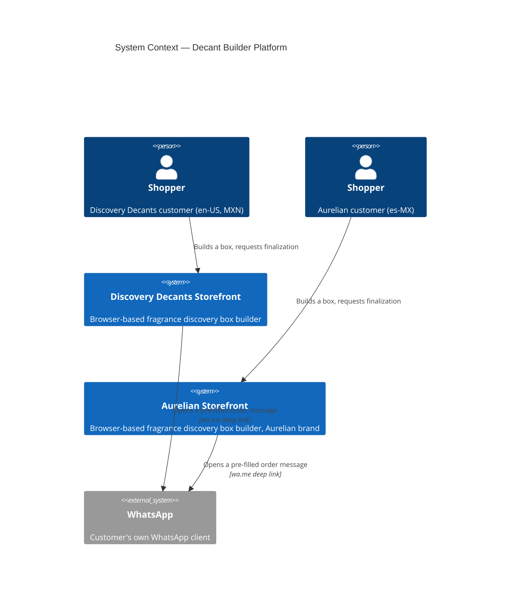
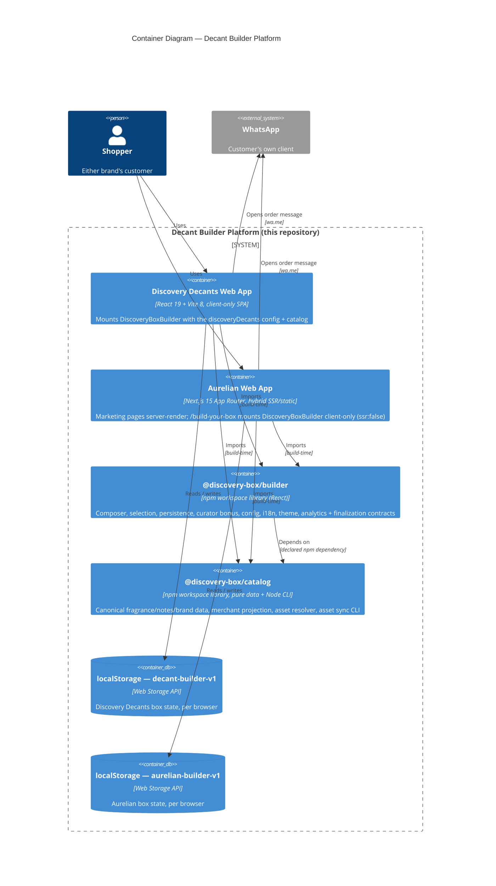
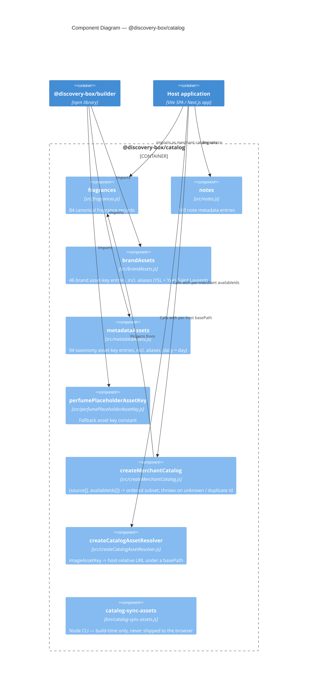
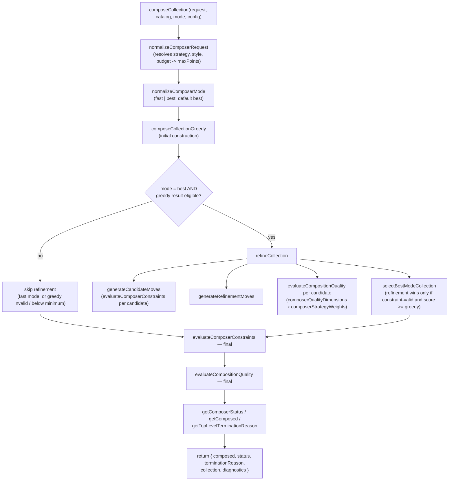
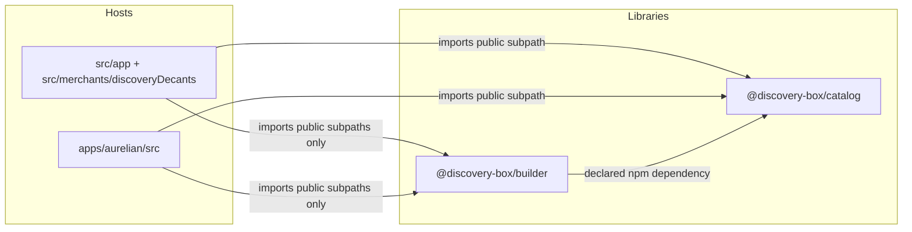

# Decant Builder — System Architecture

*Living architecture documentation · reverse-engineered from source*

A C4 model (Context → Container → Component → Code) of the system as it is implemented today. Every box, boundary, and arrow below is backed by a specific file read during this review — not by `README.md`, `PROJECT_STATE.md`, or any other prose documentation, which describe an earlier and smaller version of this system.

- **Repository:** decant-builder (npm workspaces)
- **As of:** 2026-08-07
- **Method:** direct source + test inspection, not docs

## Contents

- [Scope & method](#scope--method)
- [L1 · System Context](#l1--system-context)
- [L2 · Container](#l2--container)
- [L3 · Component — @discovery-box/builder](#l3--component--discovery-boxbuilder)
- [L3 · Component — @discovery-box/catalog](#l3--component--discovery-boxcatalog)
- [L4 · Code — Composer Core call graph](#l4--code--composer-core-call-graph)
- [Public contracts](#public-contracts)
- [Bounded contexts](#bounded-contexts)
- [Dependency direction](#dependency-direction)
- [Runtime boundaries](#runtime-boundaries)
- [Not yet verified](#not-yet-verified)

## Scope & method

This document was built by reading the implementation directly: package manifests, merchant configuration files, the Composer engine, persistence and finalization code, and — critically — the project's own architecture-boundary tests, which encode more precise and current contracts than any prose file in the repository.

Primary evidence included: `package.json` workspace manifests and export maps for `@discovery-box/builder` and `@discovery-box/catalog`; `createBuilderConfig` / `validateBuilderConfig`; both merchant configs (`discoveryDecants`, `aurelian`); `BuilderRuntime.jsx`; the Composer subsystem (`composeCollection`, `evaluateComposerConstraints`, `evaluateCompositionQuality`, `normalizeComposerRequest`, `generateCandidateMoves`); `createWhatsAppFinalizationAdapter`; `builderPersistence.js`; the host mount points (`DiscoveryDecantsApp.jsx`, `BuilderMount.jsx`, `BuilderExperience.jsx`); and five boundary/architecture tests (`packageBoundary`, `catalogPackageBoundary`, `hostEnvironmentBoundary`, `composerMerchantBoundary`, `analyticsArchitecture`).

## L1 · System Context

Two independently branded storefronts, no backend of any kind, and one external system reached by deep link rather than by API integration.

> **Reads as:** no payment processor, order database, inventory system, or authentication provider exists anywhere in this system. "Checkout" is a browser opening `wa.me` with a pre-filled message; everything past that point is a human reading WhatsApp.

## L2 · Container

Two runtime containers (one per brand) share two build-time libraries. Nothing in this diagram runs on a server the team operates — the Next.js app's server-rendered routes are marketing pages only.

> **Note:** `@discovery-box/builder` and `@discovery-box/catalog` are drawn as containers because they are the system's major structural units, not because they run independently — they are compiled into each web app at build time. Both hosting targets (Vercel, per `apps/aurelian/README.md`) are static/edge hosts; there is no application server container in this system.

## L3 · Component — @discovery-box/builder

One public entry point (`DiscoveryBoxBuilder`) wraps a composition root (`BuilderRuntime`) that orchestrates thirteen internal modules. The finalization adapter is *injected* by the host, not imported internally — the only inversion-of-control boundary in the package.

```mermaid
C4Component
  title Component Diagram — @discovery-box/builder
  Container(host, "Host application", "Vite SPA or Next.js route", "Discovery Decants or Aurelian")
  Container(catalogPkg, "@discovery-box/catalog", "npm library")
  Container_Boundary(builderPkg, "@discovery-box/builder") {
    Component(entry, "DiscoveryBoxBuilder", "client.jsx / client.js — public entry", "Validates config, resolves images via host assetResolver, renders BuilderRuntime")
    Component(runtime, "BuilderRuntime (App)", "React component", "Composition root")
    Component(selection, "Selection State", "internal/selection", "add / remove / reorder / apply-intent — pure functions")
    Component(persistence, "Builder Persistence", "internal/persistence", "Schema-versioned localStorage read/write + validation")
    Component(composer, "Composer Core", "internal/composer + internal/composition", "Greedy + refinement box-proposal optimizer, merchant-agnostic")
    Component(recs, "Recommendations", "internal/recommendations", "Single-item picks, distinct from full-box proposals")
    Component(curator, "Curator Bonus", "internal/curatorBonus", "isCuratorBonusUnlocked rule")
    Component(intel, "Collection Intelligence", "internal/intelligence", "Coverage summary, Scent DNA, DNA Explorer, Scent Library")
    Component(catalogView, "Catalog View", "internal/catalog", "Filter / sort presentation model")
    Component(config, "Config System", "builder/config", "createBuilderConfig — merge, validate, deep-freeze")
    Component(i18n, "i18n", "i18n/", "createTranslator — en-US, es-MX")
    Component(theme, "Theme", "builder/theme", "Scoped CSS custom-property injection")
    Component(analyticsContract, "Analytics Contract", "analytics/", "Event allowlist, PII prohibition, noop default")
    Component(finalizationContract, "Finalization Contract", "finalization/", "createWhatsAppFinalizationAdapter — finalize(model) contract")
    Component(ui, "Presentation Components", "components/", "PerfumeCard, FilterBar, BuilderPanel, CollectionCard, MetadataPreview")
  }
  Rel(host, entry, "Renders with catalog, notes, config, assetResolver, analytics, finalizationAdapter")
  Rel(host, config, "Calls createBuilderConfig at startup")
  Rel(host, finalizationContract, "Imports + instantiates, injects instance into entry")
  Rel(entry, runtime, "Renders")
  Rel(entry, catalogPkg, "Imports perfumePlaceholderAssetKey")
  Rel(runtime, catalogPkg, "Imports brandAssets, metadataAssets")
  Rel(runtime, selection, "Uses")
  Rel(runtime, persistence, "Uses")
  Rel(runtime, composer, "Uses via buildComposerBoxProposal")
  Rel(runtime, recs, "Uses")
  Rel(runtime, curator, "Uses")
  Rel(runtime, intel, "Uses")
  Rel(runtime, catalogView, "Uses")
  Rel(runtime, i18n, "Uses")
  Rel(runtime, theme, "Uses")
  Rel(runtime, ui, "Renders")
  Rel(runtime, analyticsContract, "Emits events through host-supplied provider")
  Rel(runtime, finalizationContract, "Calls .finalize() on host-injected adapter")
```

> **Confirmed by test:** `packageBoundary.test.js` asserts the package's default export is exactly `["DiscoveryBoxBuilder"]`, that only `client.js` carries the React Server Component `"use client"` directive, and that no production module under `internal/composer` or `internal/composition` contains merchant identifiers.

## L3 · Component — @discovery-box/catalog

Pure data and pure functions. Its own boundary test forbids this package from ever mentioning React, browser globals, a merchant name, or commerce vocabulary — `pointValue` included.

> **Confirmed by test:** `catalogPackageBoundary.test.js` asserts the exported surface is exactly these seven names, that `fragrances` has length 84, `notes` has 169 keys, `brandAssets` has 46 keys, and that every fragrance/note exposes an `*AssetKey` rather than a resolved URL.

## L4 · Code — Composer Core call graph

The codebase has no classes, so the Code level here is the actual control flow of `composeCollection()` — the one subsystem complex enough to warrant it: a greedy constructor optionally followed by iterative local-search refinement, with three distinct termination paths.

> **Reads as:** refinement is never trusted blindly — `selectBestModeCollection` falls back to the greedy result if refinement produced an invalid or lower-scoring collection. The function returns *why* it stopped (one of eleven named `terminationReason` values), not just a result or an error.

## Public contracts

Exact export surfaces, taken from each package's `package.json` `exports` map and cross-checked against `packageBoundary.test.js` / `catalogPackageBoundary.test.js`, which assert these lists literally via `Object.keys(...)`.

### @discovery-box/builder

| Subpath | Dev resolves to | Prod resolves to | Exports |
|---|---|---|---|
| `.` | `src/client.jsx` | `client.js` | `DiscoveryBoxBuilder` — the only member. `client.js` is the sole file in the package carrying `"use client"`. |
| `./config` | `src/builder/config/index.js` | `dist/config.js` | `createBuilderConfig`, `defaultBuilderConfig`, `validateBuilderConfig`, `buildLocalizedConfigOverrides` — no `"use client"`, safe to import from a React Server Component. |
| `./analytics` | `src/analytics/index.js` | `dist/analytics.js` | `ANALYTICS_EVENTS`, `ANALYTICS_EVENT_NAMES`, `COMMON_CONTEXT_KEYS`, `EVENT_PAYLOAD_KEYS`, `PROHIBITED_ANALYTICS_KEYS`, `noopAnalytics`. |
| `./finalization` | `src/finalization/index.js` | `dist/finalization.js` | `createWhatsAppFinalizationAdapter` — currently the package's only finalization implementation. |
| `./styles.css` | — | `styles.css` | Namespaced builder styles, imported once by the host. |

### @discovery-box/catalog

| Subpath | Resolves to | Exports |
|---|---|---|
| `.` | `src/index.js` | `fragrances`, `notes`, `brandAssets`, `metadataAssets`, `createMerchantCatalog`, `createCatalogAssetResolver`, `perfumePlaceholderAssetKey` |
| `bin: catalog-sync-assets` | `bin/catalog-sync-assets.js` | Node CLI, invoked from each host's `predev` / `prebuild` npm script — never bundled into a browser build. |

> **Injected, not imported.** The finalization adapter is created by the **host** (each merchant's mount point) and passed into `DiscoveryBoxBuilder` as a prop. `BuilderRuntime` only ever calls `finalizationAdapter.finalize(model)` — it never imports `createWhatsAppFinalizationAdapter` itself. This is the one deliberate inversion-of-control seam in the package, confirmed by `packageBoundary.test.js` asserting that `finalization/createWhatsAppFinalizationAdapter.js` does not exist anywhere under host `src/`.

## Bounded contexts

Seven contexts, each with a home directory, an owned vocabulary, a forbidden vocabulary, and — in five of seven cases — a test that fails the build if the boundary is crossed.

**Catalog** — `packages/catalog/src`
- **Owns:** fragrance, note, brand, and taxonomy data.
- **Forbidden:** React, browser globals, merchant names, persistence / analytics / finalization / inventory / stock / `pointValue`.
- *Enforced by `catalogPackageBoundary.test.js`*

**Composer** — `builder/internal/{composer, composition}`
- **Owns:** box-proposal optimization — strategies, constraints, quality scoring, refinement.
- **Forbidden:** `merchantId`, `businessName`, "discovery-decants", "Aurelian".
- *Enforced by `composerMerchantBoundary.test.js`*

**Builder core** — `packages/builder/src` (remainder)
- **Owns:** selection, persistence, curator bonus, intelligence, presentation, config, i18n, theme, analytics/finalization contracts.
- **Forbidden:** merchant imports, `VITE_` / `import.meta.env` / `process.env` (except the host-owned `AppErrorBoundary`).
- *Enforced by `packageBoundary.test.js` + `hostEnvironmentBoundary.test.js`*

**Merchant · Discovery Decants** — `src/merchants/discoveryDecants` + `src/app`
- **Owns:** brand identity, box-rule values, en-US locale, WhatsApp number, catalog curation, dev-analytics wiring.
- **Depends downward on:** builder + catalog public subpaths only.
- *Enforced by the "hosts on public subpaths" assertion, `packageBoundary.test.js`*

**Merchant · Aurelian** — `apps/aurelian/src`
- **Owns:** brand identity, box-rule overrides, es-MX locale, dark theme, WhatsApp copy requiring name + city, marketing pages, deep-link fragrance intent parsing.
- **Analytics:** wired to `noopAnalytics` unconditionally — no active provider.
- *Enforced by the same boundary test as above*

**Analytics** — `builder/analytics` + `src/analytics`
- **Owns:** the event/payload allowlist and PII prohibition list.
- **Forbidden:** reaching into Composer or scoring modules.
- *Enforced by `analyticsArchitecture.test.js`*

**Finalization** — `builder/finalization`
- **Owns:** the `finalize(model) → {status, copied, manualUrl}` contract. One implementation today: WhatsApp deep link + clipboard fallback.
- *Shape implied by `packageBoundary.test.js`'s export assertion*

**Persistence** (`builder/internal/persistence`) sits inside the Builder-core context rather than standing alone: it reads/writes `localStorage` under a per-merchant key and schema version supplied through config, with no dedicated boundary test of its own beyond the general Builder-core rules above.

## Dependency direction

Every arrow points one way: hosts depend on libraries, and `builder` depends on `catalog`. Nothing points back.

> **Confirmed by test:** "keeps hosts on public package subpaths" (`packageBoundary.test.js`) fails the build if any host file matches `@discovery-box/builder/src/` or `packages/builder/src/`. `catalogPackageBoundary.test.js` separately confirms no host reaches into `@discovery-box/catalog`'s internals or references deleted legacy paths. No test — and no import found by inspection — points from either library back to a host or to the other host.

## Runtime boundaries

| Boundary | Where | Detail |
|---|---|---|
| Browser-only | Entire Builder UI, Composer, persistence, finalization | Uses `window`, `document`, `navigator`, `localStorage` — forbidden everywhere in the shared package except the one host-owned exception below. |
| Host-owned exception | `components/AppErrorBoundary.jsx` | The single file explicitly permitted to read a Vite `DEV` flag inside otherwise environment-neutral shared code (`hostEnvironmentBoundary.test.js` names it by exclusion). |
| Vite SPA | Discovery Decants (root `src/`) | No server at all. Dev-mode signal: `import.meta.env.DEV`. |
| Next.js hybrid | apps/aurelian | Marketing routes (`/`, `/catalogo`, `/como-funciona`, `/contacto`) render server-side / static. `/build-your-box` loads a `"use client"` tree via `next/dynamic(..., {ssr:false})` so the Builder never attempts to render on the server. Dev-mode signal: `process.env.NODE_ENV === "development"` — a different idiom from the Vite host, each host owns its own detection rather than the shared runtime reading either. |
| Node / build-time | `catalog-sync-assets` CLI | Runs only as an npm lifecycle script (`predev` / `prebuild`); copies `packages/catalog/assets/` into each host's `public/catalog-assets/`, both gitignored and regenerated per build. Never reaches the browser bundle. |

## Not yet verified

This document reflects what was directly read. A few adjacent facts are inferred from strong circumstantial evidence rather than confirmed line-by-line, and are flagged rather than asserted:

- Whether currency totals are formatted through `Intl.NumberFormat` for `es-MX`, or via simple string concatenation — inferred as a possible gap from the translator's plain-string interpolation, not confirmed by reading a number-formatting call site.
- The exact contents of `composerCollectionStyles.js`, `composerQualityDimensions.js`, and `composerStrategyWeights.js` — their existence and role in the call graph (L4) are confirmed by import and by `evaluateCompositionQuality.js`'s usage, but their internal scoring formulas were not read in full.
- Whether Discovery Decants' catalog availability list and Aurelian's are guaranteed to stay identical by any test, or are simply identical today by coincidence of both listing all 84 ids — no such test was found.

---

*Decant Builder architecture · derived exclusively from source and test inspection · treat as current until the underlying code changes, not until this document is rewritten*
